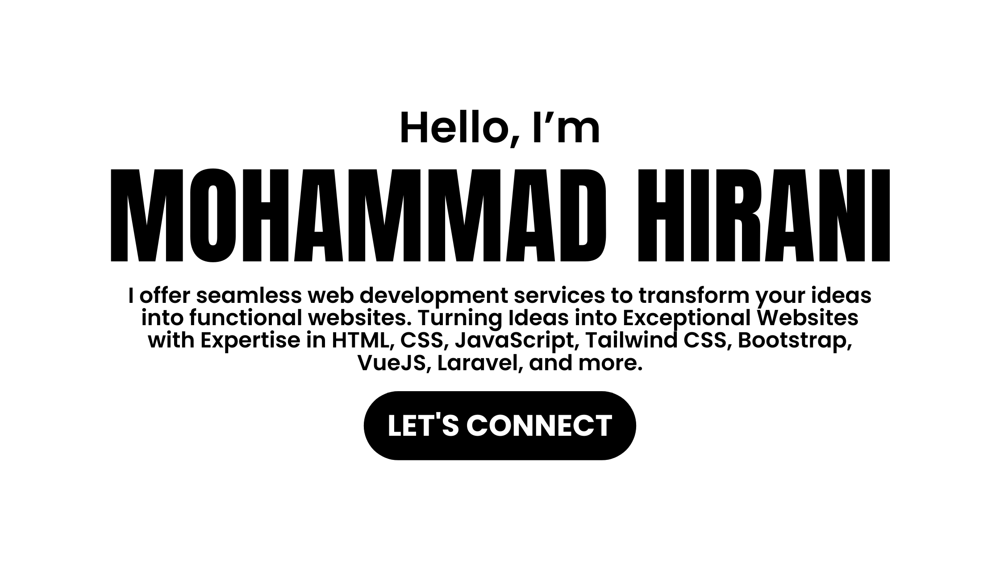

  
  
  
  
  

  

# 👋 About

Hello, I'm Mohammad Hirani 👋

I'm a passionate web developer with expertise in both frontend and backend technologies. I love crafting beautiful and functional web applications. Here's a little about what I do:

- 💼 I'm proficient in HTML, CSS, JavaScript, Tailwind CSS, Bootstrap, Vue.js, and Next.js for frontend development.
- ⚙️ On the backend, I work with PHP, Laravel, and WordPress to create robust and scalable applications.
  

# 🚀 My Tech Stack

- 💻 **Frontend**: HTML, CSS, JavaScript, Tailwind CSS, Bootstrap, Vue.js, Next.js
- 🌐 **Backend**: PHP, Laravel, WordPress
- 🗄️ **Databases**: MySQL

